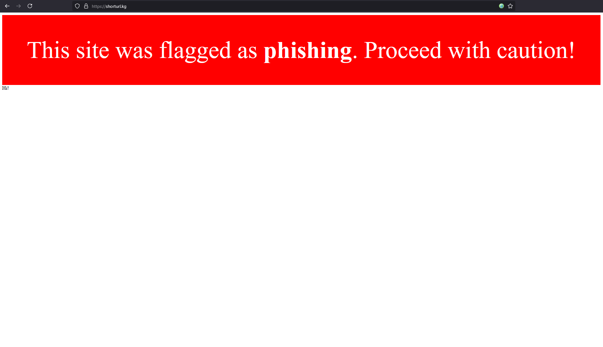

# TrustScanner

A Tampermonkey userscript that checks websites for dangerous categories (malware, phishing) and displays a warning banner if a threat is detected.

The script queries the current domain via the FishFish API: [https://fishfish.gg/](https://fishfish.gg/).

## Usage

- Install the script in Tampermonkey.  
- Make sure to allow the permission for `cross-origin resource` in Tampermonkey settings.
- If the site is flagged, a red warning banner appears at the top of the page.

## Example

## AI

This project was developed with AI assistance in following areas:
* Debugging 
* README creation.